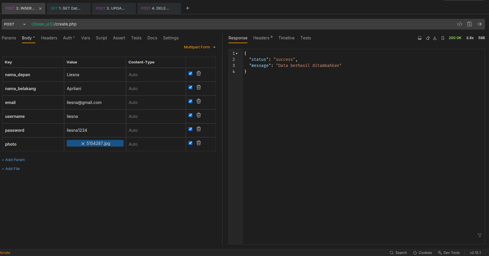
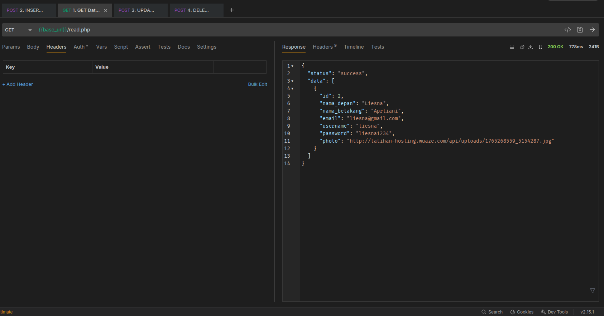
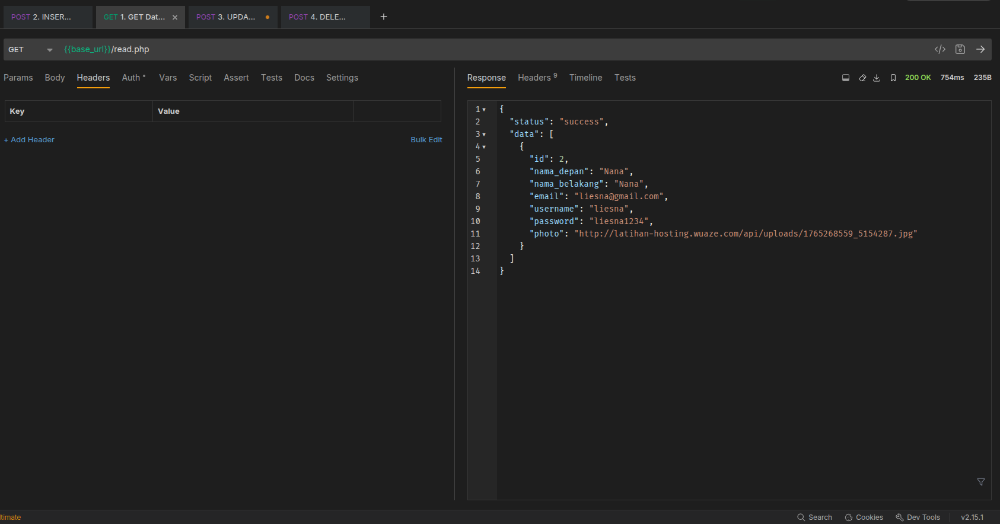
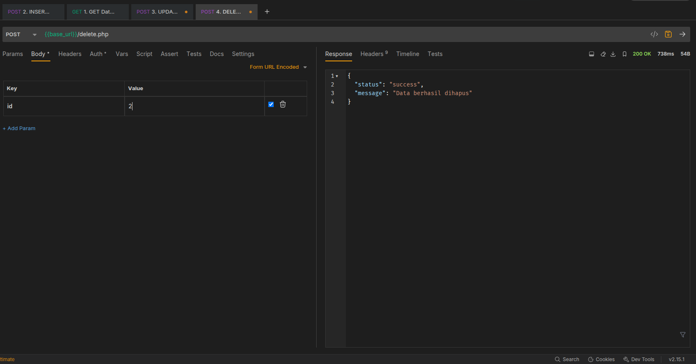
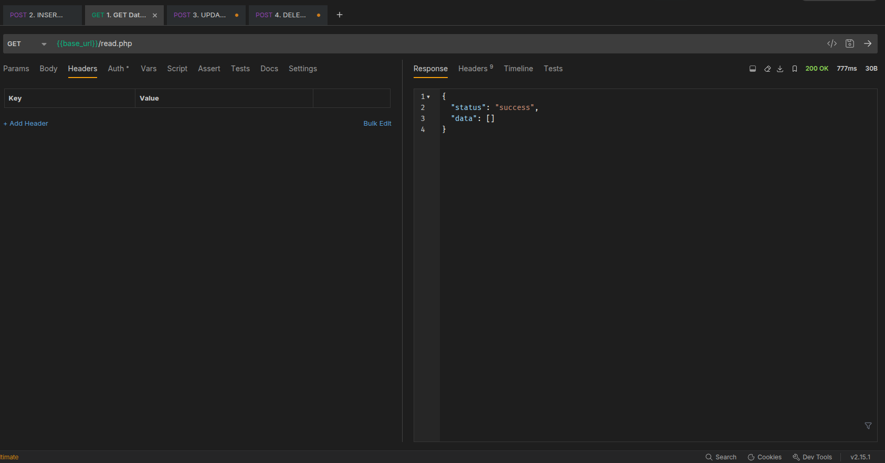

# Dokumentasi & Laporan Pengujian API (CRUD)

---

## 🌐 Base URL
Semua request di bawah ini dilakukan ke alamat server berikut:
`https://latihan-hosting.wuaze.com/api`

> **Catatan:** Karena menggunakan hosting gratis (InfinityFree), request header menyertakan Cookie `__test` untuk bypass proteksi anti-bot JavaScript.

---

## 📸 Bukti Pengujian (Screenshots)

Berikut adalah bukti tangkapan layar (screenshot) dari aplikasi **Bruno** yang menunjukkan status **200 OK** dan respon JSON yang valid.

### 1. CREATE Data (Insert)
Menambahkan data user baru beserta upload foto ke server.
* **Endpoint:** `/create.php`
* **Method:** `POST`
* **Body Type:** `Multipart Form`

*Terlihat respon JSON "Data berhasil ditambahkan" dan status 200 OK.*

---

### 2. READ Data (Get All)
Mengambil seluruh data user yang tersimpan di database dalam format JSON.
* **Endpoint:** `/read.php`
* **Method:** `GET`

*Data yang baru saja diinput terlihat muncul di dalam list JSON.*

---

### 3. UPDATE Data
Mengedit data user berdasarkan ID tertentu.
* **Endpoint:** `/update.php`
* **Method:** `POST`
* **Body Type:** `Form URL Encoded` / `Multipart`

*Respon menunjukkan data berhasil diupdate.*

---

### 4. READ Data (Get All)
Mengambil seluruh data user yang tersimpan di database dalam format JSON.
* **Endpoint:** `/read.php`
* **Method:** `GET`

*Data terbaru terlihat muncul di dalam list JSON.*

---

### 5. DELETE Data
Menghapus data user berdasarkan ID.
* **Endpoint:** `/delete.php`
* **Method:** `POST`

*Data berhasil dihapus dari database.*

---

### 6. READ Data (Get All)
Mengambil seluruh data user yang tersimpan di database dalam format JSON.
* **Endpoint:** `/read.php`
* **Method:** `GET`

*Data terbaru terlihat muncul di dalam list JSON.*

---
